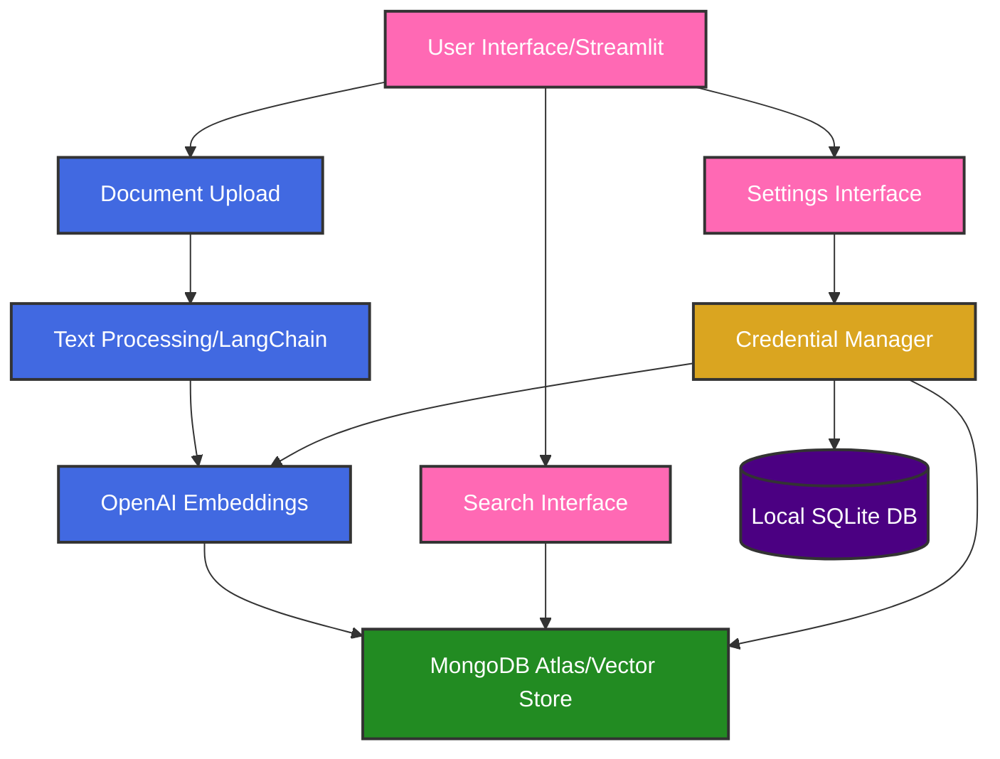
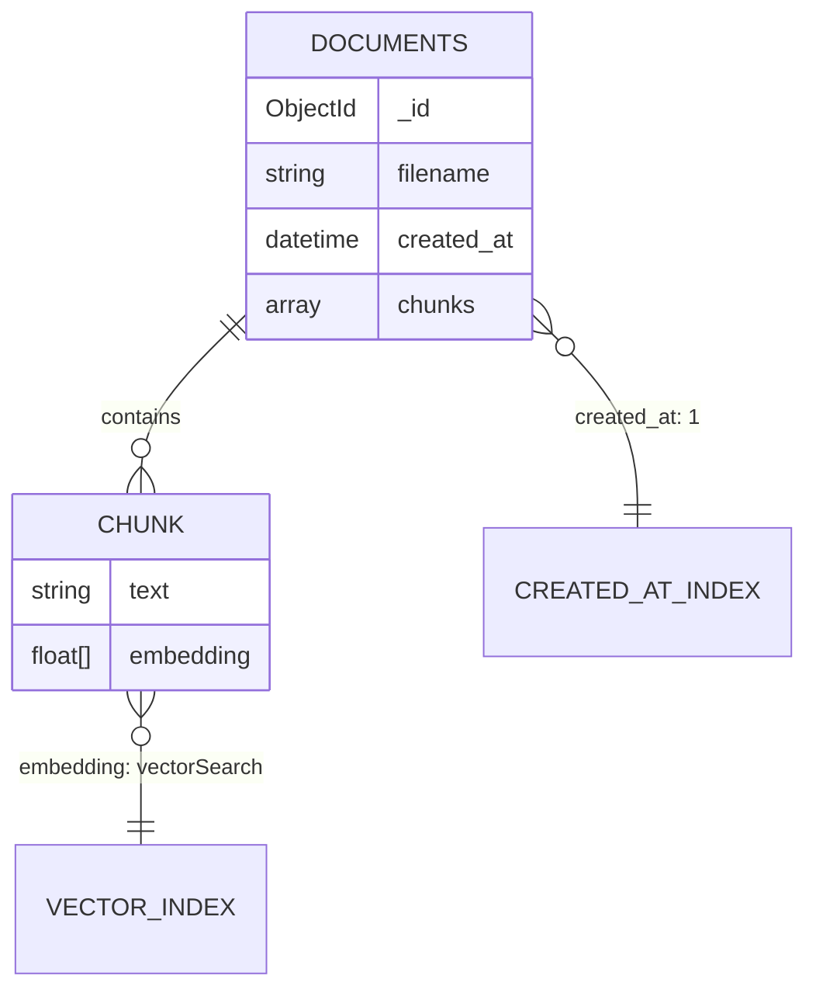
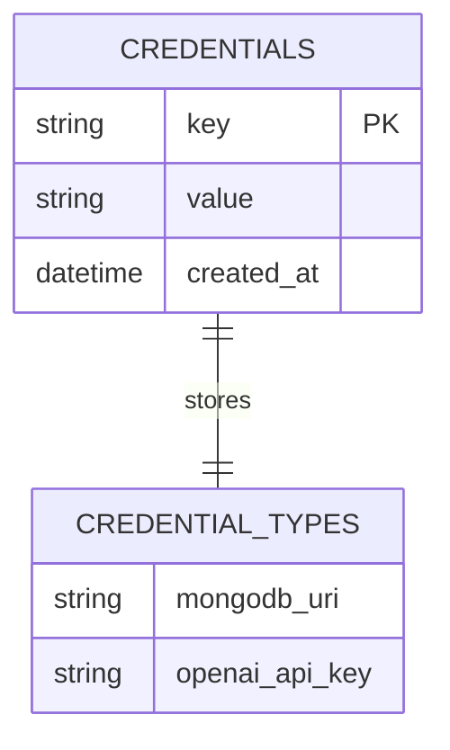
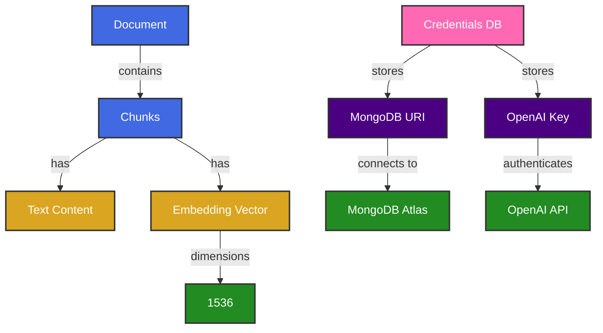

# Document Search & Vectorization Application

A modern web application for document upload, vectorization, and semantic search using OpenAI embeddings and MongoDB Atlas.

## 🚀 Features

- Document upload and processing (PDF & TXT support)
- Text chunking and vectorization using OpenAI's text-embedding-3-small model
- Vector storage in MongoDB Atlas
- Semantic search with relevance scoring
- Dark mode UI with responsive design
- Document library with grid layout
- Interactive document preview and chunk viewer
- Secure credential management with SQLite
- Real-time connection status monitoring
- Detailed logging system

## 🛠️ Technology Stack

### Frontend
- **Streamlit**: Modern web application framework for Python
- **Custom CSS**: Styled components and responsive design
- **Grid Layout**: Responsive document card grid
- **Dark Theme**: Consistent dark mode styling

### Backend
- **Python 3.12**: Core programming language
- **OpenAI API**: Text embedding generation using `text-embedding-3-small` model
- **MongoDB Atlas**: Vector database for document storage and retrieval
- **SQLite**: Local credential storage
- **PyPDF2**: PDF text extraction
- **Logging**: Structured logging system

### Project Structure
```
doc-upload-test/
├── Home.py                 # Main application entry
├── pages/                  # Streamlit pages
│   ├── 1_Document_Search.py
│   ├── 2_Document_Library.py
│   ├── 4_Logs.py
│   └── 5_Settings.py
├── utils/                  # Utility modules
│   ├── document_processor.py
│   ├── mongodb.py
│   ├── openai_client.py
│   ├── sqlite_client.py
│   ├── styles.py
│   └── logger.py
├── data/                   # Data storage
│   ├── processed/         # Processed documents
│   ├── uploads/          # Temporary uploads
│   └── credentials.db    # SQLite database
├── logs/                   # Application logs
├── static/                 # Static assets
├── .streamlit/            # Streamlit configuration
├── requirements.txt       # Python dependencies
└── setup.sh              # Setup script
```

### Key Libraries
- `openai==1.12.0`: OpenAI API client
- `pymongo==4.6.2`: MongoDB driver
- `streamlit==1.32.0`: Web interface
- `PyPDF2==3.0.1`: PDF processing
- `python-dotenv==1.0.0`: Environment management

## 🏗️ System Architecture

### Architecture Diagram


### Process Flow
1. **Credential Management**
   - User enters API credentials in Settings
   - Credentials stored in SQLite database
   - Loaded into session state on application start
   - Real-time connection status monitoring

2. **Document Upload**
   - Support for PDF and TXT files
   - Automatic file type detection
   - Text extraction with PyPDF2 for PDFs
   - Progress tracking during processing

3. **Text Processing**
   - Smart text chunking with sentence boundary detection
   - Configurable chunk size (1000 chars) and overlap (200 chars)
   - Metadata preservation
   - Error handling and logging

4. **Embedding Generation**
   - Chunk vectorization using OpenAI API
   - text-embedding-3-small model (1536 dimensions)
   - Batch processing for efficiency
   - Error recovery and retry logic

5. **Storage**
   - MongoDB Atlas vector storage
   - Document metadata and chunks
   - Automatic connection management
   - Error handling and reconnection

6. **Search Process**
   - Semantic search with relevance scoring
   - Vector similarity calculation
   - Results ranked by relevance percentage
   - Interactive result previews

## 📊 Database Schemas

### MongoDB Document Store


### Local Credentials Store


### Data Relationships


### Key Features
- **MongoDB Indexes**:
  - `created_at`: Ascending index for efficient sorting
  - `chunks.embedding`: Vector index for similarity search
- **SQLite Features**:
  - Single-table design for simplicity
  - Key-value structure for flexibility
  - Timestamp tracking for auditing
- **Data Types**:
  - Text content: UTF-8 encoded strings
  - Embeddings: 1536-dimensional float arrays
  - Timestamps: UTC datetime objects

## 🔐 Credential Management

The application uses SQLite for credential management:

1. **Storage**: Local SQLite database in `data/credentials.db`
2. **Schema**: Simple key-value store for credentials
3. **Features**:
   - Automatic database initialization
   - Connection status monitoring
   - Credential validation
   - Clear credentials option
   - Session state synchronization

## 🚀 Getting Started

1. Clone the repository
2. Create a virtual environment:
   ```bash
   python -m venv venv
   source venv/bin/activate  # On Windows: venv\Scripts\activate
   ```
3. Install dependencies:
   ```bash
   pip install -r requirements.txt
   ```
4. Run the application:
   ```bash
   streamlit run app.py
   ```
5. Configure your credentials in the Settings page:
   - Enter your OpenAI API key
   - Enter your MongoDB connection string
   - Click "Save Settings"

## 🔮 Future Enhancements

1. **Search Improvements**
   - Implement vector similarity search
   - Add relevance scoring
   - Support for multiple document types

2. **User Experience**
   - Document preview
   - Search history
   - Batch processing

3. **Performance**
   - Caching layer
   - Async processing
   - Rate limiting

4. **Security**
   - User authentication
   - Document encryption
   - Access control
   - Enhanced credential encryption

## 📝 License

This project is licensed under the MIT License - see the LICENSE file for details. 