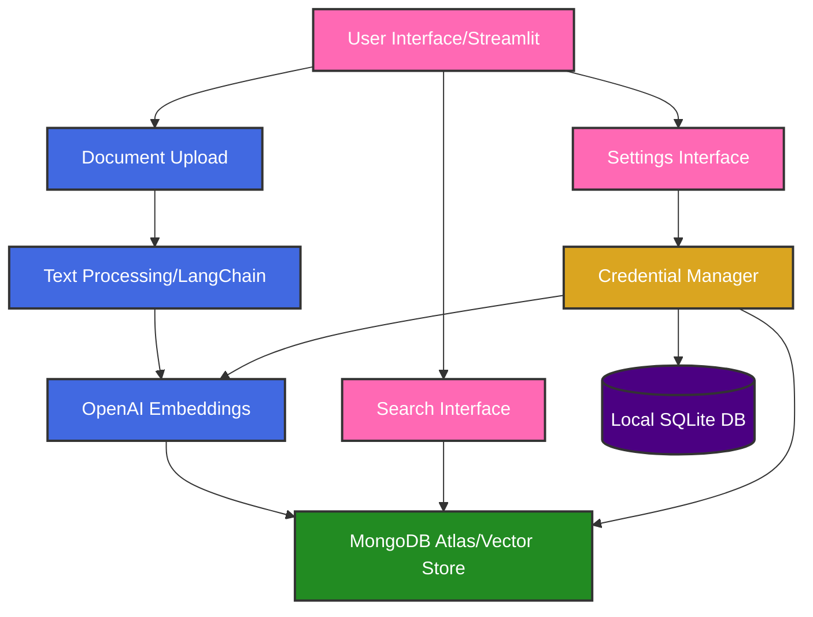

# Document Search & Vectorization Application

A modern web application for document upload, vectorization, and semantic search using OpenAI embeddings and MongoDB Atlas.

## 🚀 Features

- Document upload and processing
- Text chunking and vectorization using OpenAI's text-embedding-3-small model
- Vector storage in MongoDB Atlas
- Semantic search capabilities
- Dark mode support
- Responsive design
- Document library with card-based interface
- Interactive document preview
- Secure local credential management

## 🛠️ Technology Stack

### Frontend
- **Streamlit**: Modern web application framework for Python
- **Custom CSS**: Styled components and responsive design

### Backend
- **Python 3.12**: Core programming language
- **OpenAI API**: Text embedding generation using `text-embedding-3-small` model
- **MongoDB Atlas**: Vector database for document storage and retrieval
- **LangChain**: Text processing and chunking utilities
- **SQLite**: Local encrypted credential storage
- **Cryptography**: Secure credential encryption

### Key Libraries
- `openai==1.12.0`: OpenAI API client
- `pymongo==4.6.2`: MongoDB driver
- `langchain==0.1.12`: Text processing utilities
- `cryptography==42.0.5`: Credential encryption
- `httpx==0.24.1`: Modern HTTP client

## 🏗️ System Architecture

### Architecture Diagram


### Process Flow
1. **Credential Management**
   - User enters API credentials in Settings
   - Credentials encrypted using machine-specific key
   - Stored in local SQLite database
   - Loaded into session state when needed

2. **Document Upload**
   - User uploads document through Streamlit interface
   - File is read and converted to text

3. **Text Processing**
   - Document is split into chunks using LangChain
   - Chunk size: 1000 characters
   - Overlap: 200 characters
   - Ensures context preservation

4. **Embedding Generation**
   - Each chunk is sent to OpenAI API
   - Using `text-embedding-3-small` model
   - Generates 1536-dimensional vectors

5. **Storage**
   - Vectors stored in MongoDB Atlas
   - Document metadata preserved
   - Timestamps added for tracking

6. **Search Process**
   - User enters search query
   - Query converted to embedding
   - Vector similarity search performed
   - Results ranked by relevance

## 📊 Database Schemas

### MongoDB Collection: `documents`

```json
{
    "_id": ObjectId,
    "filename": String,
    "created_at": DateTime,
    "chunks": [
        {
            "text": String,
            "embedding": [Float]  // 1536-dimensional vector
        }
    ]
}
```

### Local SQLite Credentials DB

```sql
CREATE TABLE credentials (
    key TEXT PRIMARY KEY,
    value TEXT NOT NULL,
    created_at TIMESTAMP DEFAULT CURRENT_TIMESTAMP
);
```

### Indexes
- MongoDB: `created_at`: 1 (for sorting by upload date)
- MongoDB: `chunks.embedding`: "vectorSearch" (for vector similarity search)

## 🔐 Credential Management

The application uses a secure local credential management system:

1. **Storage Location**: `~/.docsearch/credentials.db` (SQLite database)
2. **Encryption**: 
   - Machine-specific encryption key
   - Generated using PBKDF2 with SHA256
   - Stored in `~/.docsearch/.key`
3. **Credentials Stored**:
   - OpenAI API Key
   - MongoDB Connection String
4. **Security Features**:
   - Encrypted at rest
   - Never exposed in environment variables
   - Session-based access
   - Can be cleared via Settings page

## 🚀 Getting Started

1. Clone the repository
2. Create a virtual environment:
   ```bash
   python -m venv venv
   source venv/bin/activate  # On Windows: venv\Scripts\activate
   ```
3. Install dependencies:
   ```bash
   pip install -r requirements.txt
   ```
4. Run the application:
   ```bash
   streamlit run app.py
   ```
5. Configure your credentials in the Settings page:
   - Enter your OpenAI API key
   - Enter your MongoDB connection string
   - Click "Save Settings"

## 🔮 Future Enhancements

1. **Search Improvements**
   - Implement vector similarity search
   - Add relevance scoring
   - Support for multiple document types

2. **User Experience**
   - Document preview
   - Search history
   - Batch processing

3. **Performance**
   - Caching layer
   - Async processing
   - Rate limiting

4. **Security**
   - User authentication
   - Document encryption
   - Access control
   - Enhanced credential encryption

## 📝 License

This project is licensed under the MIT License - see the LICENSE file for details. 